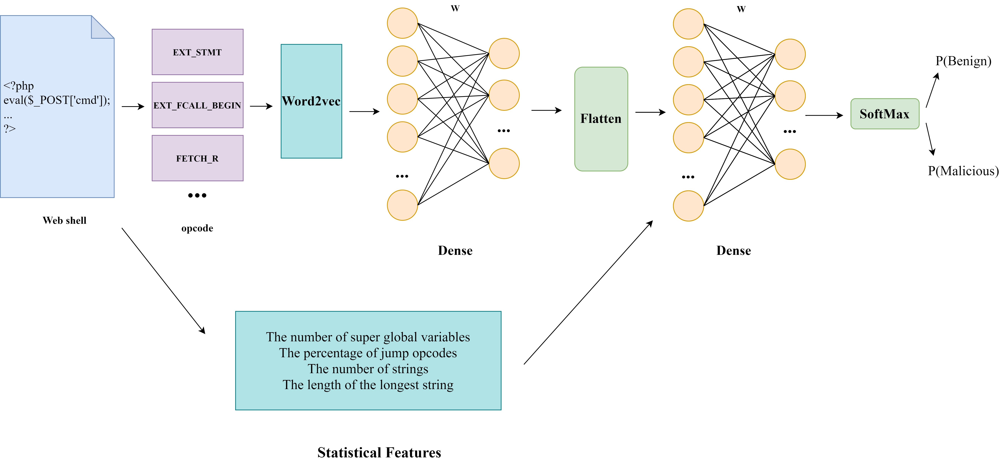

# CWSOGG

This is the code for the paper: [CWSOGG: Catching Web Shell Obfuscation Based on Genetic Algorithm and Generative Adversarial Network](https://doi.org/10.1093/comjnl/bxac040).

Please cite the above paper if you use our code.

The code is released under the [GPLv3](/COPYING).

[中文](/readme_cn.md)

## Introduction

* This project is based on the GAN framework to improve the detect rate of the neural network for the obfuscated Web shells and improve the diversity of Web shell data sets as well.
* The generator is based on GA to combine the given bypass functions to generate obfuscated Web shells.
* The discriminators extracts high-level features and low-level features at the same time, and uses neural networks for detection.

the CWSOGG framework:


models:

* attention:


* LSTM:


* CNN:


* DNN:



## Environment

php7.4:

```bash
sudo apt -y install software-properties-common
sudo add-apt-repository ppa:ondrej/php
sudo apt-get update

sudo apt install php7.4-dev
```

* then go to <http://pecl.php.net/package/vld> and install vld, ensure you add the vld ext to your **php-cli** config
* `pip install tensorflow==2.5(cpu or gpu version) sklearn gensim==3.8.1 geatpy==2.3 seaborn pandas matplotlib func-timeout`
* edit the configuations in `utlis.py`(`good_dir, bad_dir...`)

## Reproducing the results in the paper

run the codes orderly:

1. vectorize the data sets：data_prepare.py
2. gan training for the four models：gan_run.py
3. model comparison：model_compare.py
4. handmade dataset test：ob_handmake_test.py
5. after running all of the codes,the evaluation is logged in `/result/`

The experiment results may be slightly different from the results in the paper, as the obfuscation methods are optimized randomly and the datasets are randomly seperated.

## File directories

* discriminator：Web shell detection models(lstm, attention, DNN, CNN)
* shellgenerator：GA based Web shell generator
* bin：the data pickles, etc.
* model：model storage
* data：datasets
* etc：something not so important
* tmp：temp files
* log：log dir
* result：evaluation results
* CFG: control flow graph extraction

## Evaluation files

* gan_obfuscated_[model]_eval.txt：Evaluation of the [model] on newly generated obfuscated shells on every epoch.
* gan_train_[model]_eval.txt：Evaluation of the [model] on newly generated obfuscated shells on every epoch after current epoch's gan training.
* gan_train_[model]_[epoch_num].txt: Evaluation of the [model] on origin shells on every epoch.
* ob_shell_[model]_num.txt：The number of obfuscated samples obtained in every epoch of [model].
* orig_data_num.txt：Record the number of the origin datas.
* data/obfuscated：The shell obtained in an epoch, will be emptied after every epoch.
* data/obfuscated_bak：The shell obtained after all the epoches.

## LICENSE

[LICENSE](/COPYING)
