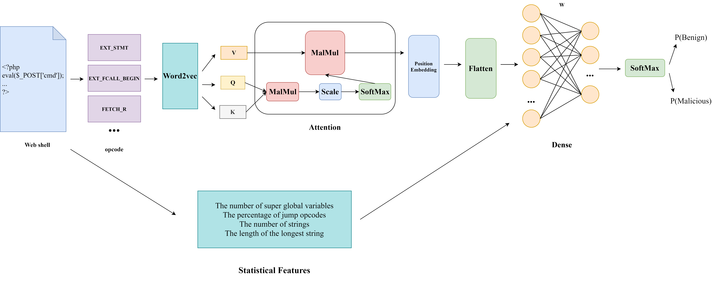
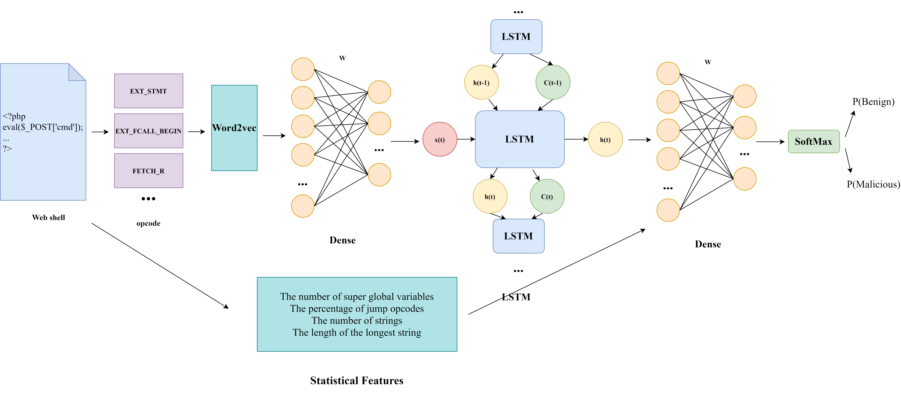

# CWSOGG

论文[CWSOGG: Catching Web Shell Obfuscation Based on Genetic Algorithm and Generative Adversarial Network](https://doi.org/10.1093/comjnl/bxac040)的源码。

如果使用相关代码，请引用上文。

LICENSE：[GPLv3](/COPYING)。

[English](/readme.md)

## Introduction

* 本项目使用GAN框架提高神经网络对混淆Web shell的检出率，并提高Web shell数据集的多样性
* 生成器主要通过GA对给出的绕过函数进行组合从而产生混淆Web shell
* 判别器采取多种特征结合的模型

CWSOGG 框架:


判别器模型:

* attention:



* LSTM:



* CNN:


* DNN:


## 环境

* 安装php7

```bash
sudo apt -y install software-properties-common
sudo add-apt-repository ppa:ondrej/php
sudo apt-get update

sudo apt install php7.4-dev
```

* 参考<http://pecl.php.net/package/vld>，安装 vld <http://pecl.php.net/package/vld>
* `pip install tensorflow==2.5(cpu 或 gpu 版本) sklearn gensim==3.8.1 geatpy==2.3 seaborn pandas matplotlib func-timeout`
* 修改`utlis.py`中的设置(`good_dir, bad_dir...`)
* 如果运行时内存不足被Killed，可以增加虚拟内存

## 原文复现

* 向量化数据集：data_prepare.py
* 超参数选择：hp_select.py
* 四种模型的gan训练：gan_run.py
* 模型对照实验：model_compare.py
* 手工仿真数据测试实验：ob_handmake_test.py
* GA与随机混淆的对比：ga_vs_random_xxx.py
* 实验完成后，评估结果在result文件夹

## 文件路径

* discriminator：Web shell机器学习检测模型（lstm、attention、DNN、CNN）
* shellgenerator：基于GA的混淆Web shell生成器
* bin：数据pickle储存等
* model：模型储存
* data：数据集
* etc：杂项
* tmp：临时文件夹
* log：运行记录文件夹
* result：实验结果保存
* CFG: 控制流图生成

## 评估文件以及生成文件

* gan_obfuscated_[model]_eval.txt：[model]的每个epoch神经网络对新产生的混淆shell的评估
* gan_train_[model]_eval.txt：[model]的每个epoch神经网络在新训练后对产生的shell的评估
* gan_train_[model]_[epoch_num].txt: [model]的第epoch_num个epoch对最开始的测试集的评估结果
* ob_shell_[model]_num.txt：[model]的每个epoch得到的混淆样本数量
* orig_data_num.txt：记录原始数据的数量
* data/obfuscated：单轮得到的shell，每个epoch都要清空
* data/obfuscated_bak：所有epoch得到的shell

## LICENSE

[LICENSE](/COPYING)
